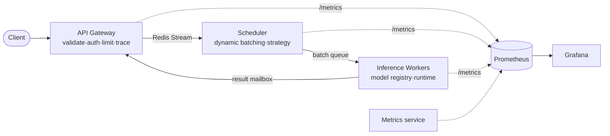

# PyTorch Inference Platform

A low-latency ML inference **serving system** — the kind of infrastructure that
sits *underneath* TorchServe, Triton, Ray Serve and BentoML, rebuilt small enough
to read in an afternoon and rigorous enough to review like production code.

> **This project is not an ML application. The project *is* the inference
> infrastructure.** The model is a placeholder; the engineering is the point.

Companion code for the talk **“Engineering Low-Latency ML Inference Systems with
PyTorch.”**

---

## Why this exists (the 60-second version)

Calling `model.predict()` behind a web handler wastes your accelerator: every
request is a batch-of-1, the GPU sits idle, and tail latency explodes under load.
Real inference platforms **decouple admission (HTTP) from execution (the
accelerator)** with a queue and a **dynamic batcher** in between. That single move
unlocks batching, backpressure, prioritization, independent scaling, and
zero-downtime model rollout. This repo builds exactly that, with every seam made
explicit. Full rationale: **[docs/ARCHITECTURE.md](docs/ARCHITECTURE.md)**.

```
Client → API Gateway → Scheduler Queue → Dynamic Batcher → Worker Pool → PyTorch Runtime → Response
```

Measured on the bundled stub backend, dynamic batching delivers **~4.4× the
throughput** of batch-of-1 serving while *keeping* latency bounded — concurrency
alone does neither (see [docs/BENCHMARKS.md](docs/BENCHMARKS.md)).

---

## Architecture at a glance



Four independently deployable services over a Redis data plane, each in strict
**clean architecture** (`api / application / domain / infrastructure`):

| Service | Responsibility | Scales on |
|---|---|---|
| **api_gateway** | validation, auth, rate limiting, tracing, routing | RPS / CPU |
| **scheduler** | queue management, **dynamic batching**, FIFO/priority/weighted strategy | (cheap; consumer group) |
| **inference_worker** | model loading + registry, runtime execution, batch compute | GPU / queue depth |
| **metrics** | platform-global telemetry (queue depth, worker liveness) | n/a |

`libs/platform_common` is the shared kernel: message schemas, settings, Redis
messaging primitives, observability, errors, and utilities (circuit breaker,
token bucket, timing).

---

## Quickstart

### Run the whole stack (no GPU, no torch required)

```bash
cp .env.example .env
docker compose up --build -d
docker compose up -d --scale inference-worker=3      # scale the worker tier

curl -s -X POST http://localhost:8080/v1/classify \
  -H "X-API-Key: demo-key-staff" \
  -F "file=@your.jpg" -F "model=resnet" -F "priority=2" -F "top_k=5" | jq
```

| URL | What |
|---|---|
| http://localhost:8080/docs | Gateway OpenAPI |
| http://localhost:3000 | Grafana dashboard (auto-provisioned) |
| http://localhost:9090 | Prometheus |
| http://localhost:9000/v1/stats | Platform state snapshot |

The worker runs the **stub runtime** by default (NumPy, deterministic) so the
entire platform — batching, scheduling, observability, fault tolerance — runs and
benchmarks on any laptop. Flip to real PyTorch with `RUNTIME_BACKEND=torch_eager`
and the `.[ml]` extras.

### Develop locally (Python 3.13)

```bash
make install            # control-plane deps + common lib (no torch)
make test               # 28 tests: pure-domain + full pipeline on fakeredis
make bench-concurrency  # the batching speedup, on your machine
make install-ml         # optional: real torch / onnx runtime
make seed-models        # export v1/v2/v3 TorchScript + ONNX artifacts
```

Run services individually: `make run-gateway`, `make run-scheduler`,
`make run-worker`, `make run-metrics` (needs a local Redis: `docker run -p6379:6379 redis`).

---

## What's implemented (mapping to the brief)

- **Dynamic batching** — configurable `MAX_BATCH_SIZE` / `MAX_WAIT_MS`, flush on
  size *or* timeout, homogeneous-by-model batches.
  [`scheduler/domain/batcher.py`](services/scheduler/domain/batcher.py)
- **Scheduling strategies** — FIFO / Priority / Weighted via the Strategy Pattern
  + factory. [`scheduler/domain/strategies.py`](services/scheduler/domain/strategies.py)
- **Concurrency comparison** — naive / async / worker-pool / batched, with
  p50/p95/p99. [`benchmarks/concurrency_comparison.py`](benchmarks/concurrency_comparison.py)
- **PyTorch optimizations** — eval, no_grad, inference_mode, TorchScript, AMP,
  quantization, ONNX export — applied in the serving path
  ([`torch_backend.py`](services/inference_worker/infrastructure/backends/torch_backend.py))
  and benchmarked
  ([`pytorch_optimizations.py`](benchmarks/pytorch_optimizations.py)).
- **Model management** — `ModelRegistry` with versioning, lazy + warm loading,
  LRU cache, and **hot reload / promotion** with no downtime.
  [`inference_worker/domain/registry.py`](services/inference_worker/domain/registry.py)
- **Pluggable runtimes** — `stub` / `torch_eager` / `torchscript` / `onnx` behind
  one `RuntimeBackend` port + factory.
- **Observability** — Prometheus metrics (`request_count`, `request_latency`,
  `batch_size`, `queue_depth`, `worker_utilization`, `inference_time`),
  Grafana dashboard, OpenTelemetry tracing, a `trace_id` threaded across services.
- **Fault tolerance** — circuit breaker, queue-overflow backpressure, request
  timeouts + deadlines, retries w/ jitter, reliable batch queue with
  **worker crash recovery** (janitor), graceful shutdown.
- **Load testing** — Locust with a stepped 100/500/1000-RPS shape.
- **Infra** — Dockerfile, docker-compose, Prometheus, Grafana provisioning,
  OTel collector, and Kubernetes manifests with HPAs.

---

## Patterns & quality

SOLID throughout; hand-wired **Dependency Injection** at each composition root;
**Repository/Facade** for the data plane; **Strategy** for scheduling; **Factory**
for runtimes; clean-architecture layering with `domain` importing nothing from
`infrastructure`. Full type hints, Pydantic v2 contracts, `ruff` + `mypy --strict`
configured. Tests cover the batching math, every strategy, the registry
(LRU/lazy/hot-reload), the executor (incl. per-item failure isolation), the
circuit breaker, the rate limiter, image validation, and a **full
gateway→scheduler→worker→gateway** integration run on fakeredis.

---

## Documentation

| Doc | Contents |
|---|---|
| [docs/ARCHITECTURE.md](docs/ARCHITECTURE.md) | HLD, component/lifecycle/sequence/deployment diagrams, bottleneck analysis, evolution path |
| [docs/SCALING.md](docs/SCALING.md) | which tier to scale and how to read the queue-depth signals |
| [docs/DEPLOYMENT.md](docs/DEPLOYMENT.md) | compose + k8s + GPU workers + runbook + zero-downtime rollout |
| [docs/API.md](docs/API.md) | endpoints, auth, errors, examples |
| [docs/BENCHMARKS.md](docs/BENCHMARKS.md) | result tables + how to reproduce |

---

## Repository layout

```
libs/platform_common/      shared kernel (schemas, config, messaging, observability, utils)
services/
  api_gateway/             front door — api/application/domain/infrastructure
  scheduler/               dynamic batching + strategies
  inference_worker/        model registry + runtime backends + executor
  metrics/                 platform-global telemetry exporter
benchmarks/                concurrency + pytorch-optimization harnesses
loadtest/                  Locust workloads
deploy/                    prometheus, grafana, otel, k8s manifests
docs/                      architecture & operations docs
scripts/build_models.py    export TorchScript/ONNX artifacts
```

---

## License

MIT. Built as educational, production-grade reference material.
