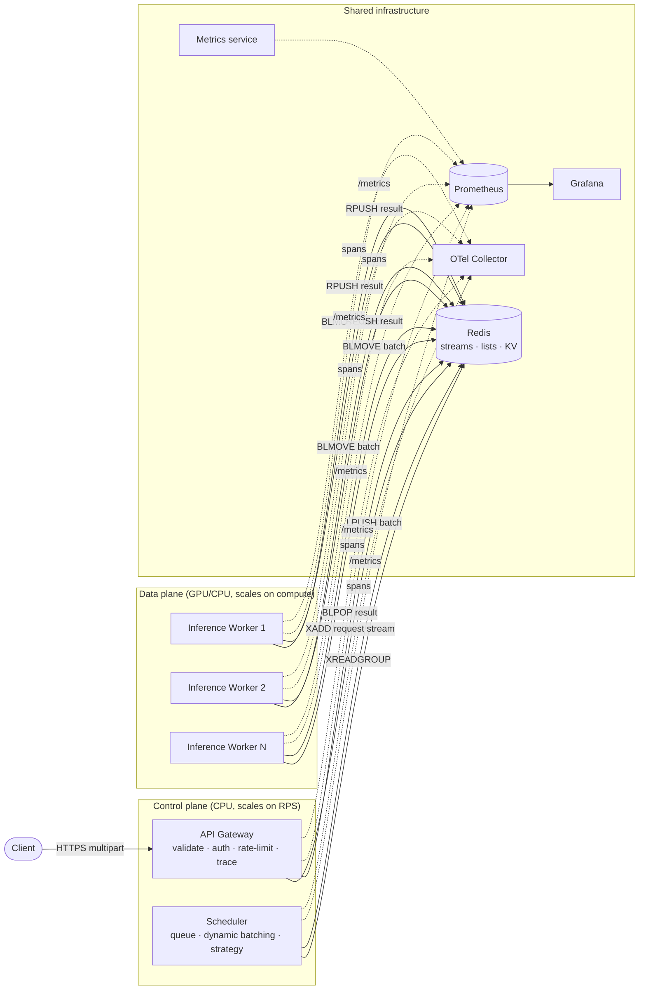
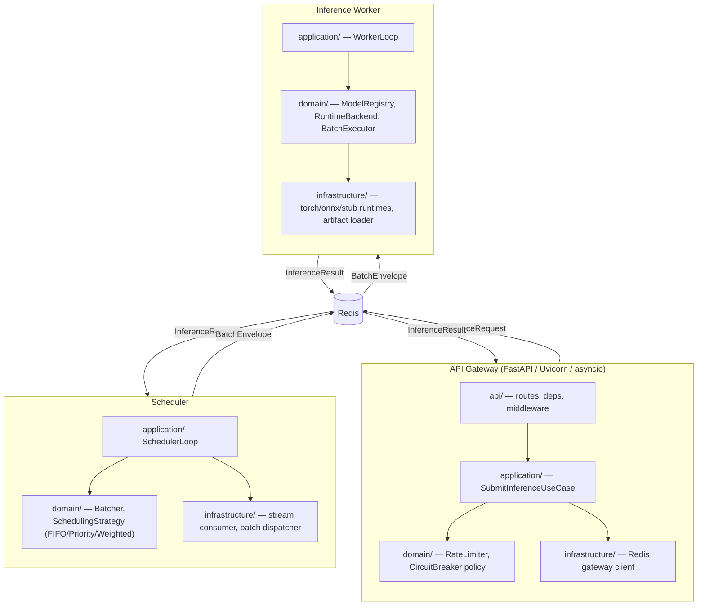
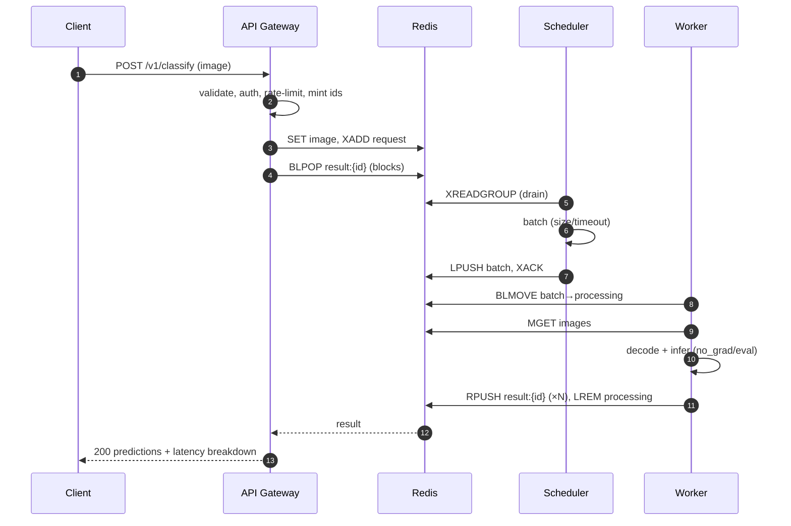
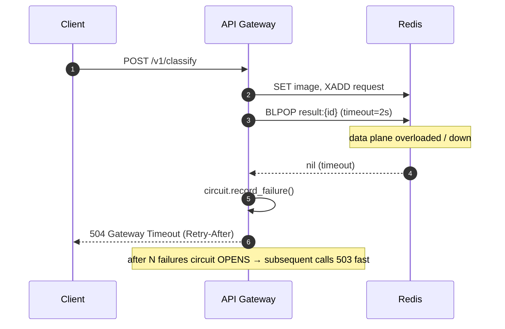
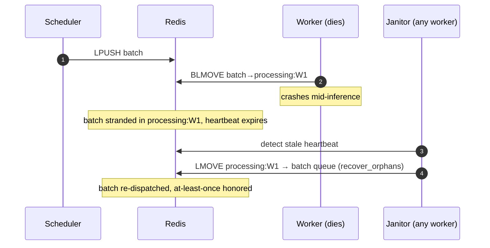
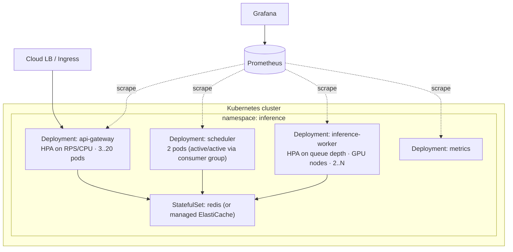

# Architecture — PyTorch Inference Platform

> Companion material for the talk *“Engineering Low-Latency ML Inference Systems with PyTorch.”*
> This document is the **design-first** artifact: read it before the code.

---

## 1. Why this platform exists

### 1.1 The naive version, and why it falls over

The simplest way to serve a model is:

```python
@app.post("/predict")
def predict(file: UploadFile):
    img = preprocess(file.read())
    with torch.no_grad():
        logits = model(img.unsqueeze(0))   # batch size = 1
    return topk(logits)
```

This works on your laptop and dies in production. The failure modes are
*structural*, not bugs you can patch:

| Problem | Why it happens | Symptom |
|---|---|---|
| **GPU starvation** | Every request runs a batch-of-1 forward pass. A GPU that can do batch-32 in ~the same wall-time as batch-1 is left 90%+ idle. | Throughput is 10–30× below the hardware ceiling. |
| **Head-of-line blocking** | The model holds the GIL / the CUDA stream during the forward pass; FastAPI's worker thread is busy. | p99 latency balloons under concurrency. |
| **No backpressure** | Requests pile into the event loop with no bound. | OOM, then cascading timeouts. |
| **No isolation** | Model load, preprocessing, and HTTP all share one process. A model reload stalls live traffic. | Deploys cause latency spikes / drops. |
| **Can't scale the bottleneck independently** | HTTP handling and GPU compute scale together even though they have wildly different cost profiles. | You over-provision GPUs to handle JSON parsing. |

### 1.2 The core insight: *decouple admission from execution*

Production inference systems (TorchServe, Triton, Ray Serve, BentoML) all share
one move: **separate the cheap, spiky, concurrent front (HTTP) from the
expensive, throughput-oriented back (the accelerator).** Between them sits a
**queue** and a **batcher**.

That is the entire reason you don't just call `model.predict()`:

- The batcher converts *many concurrent batch-of-1 requests* into *one batch-of-N
  forward pass*, which is how you actually use a GPU.
- The queue gives you a place to apply **backpressure**, **prioritization**, and
  **load shedding** — the three levers that keep tail latency bounded under
  overload.
- The split lets you **scale each tier independently** and **deploy models
  without dropping traffic**.

This repo builds that architecture, in miniature, with every seam made explicit.

---

## 2. High-Level Design

Four independently deployable services around a Redis-based data plane:



**Why this shape**

- **Stateless control plane.** Gateway and scheduler hold no durable state; any
  replica can handle any request. Scale them on **RPS / connection count**.
- **Stateful-ish data plane.** Workers hold the expensive thing (the loaded
  model in GPU memory). Scale them on **queue depth / GPU utilization**.
- **Redis as the nervous system.** One ubiquitous dependency provides the
  durable ingest stream, the reliable dispatch queue, the result mailbox, and
  the content store. (In a larger deployment you'd split these onto Kafka +
  Redis + an object store; the abstractions in `platform_common.messaging` make
  that swap mechanical.)

---

## 3. Detailed component architecture



Every service follows the same **clean-architecture** layering, dependencies
pointing *inward*:

```
api/            transport (FastAPI routes, CLI loop) — no business logic
  │  depends on
application/    use-cases / orchestration (the "what")
  │  depends on
domain/         pure business rules (batching math, strategies, registry policy)
  ▲  depended on by
infrastructure/ adapters to Redis / Torch / ONNX (the "how"), implements domain ports
```

`domain/` imports nothing from `infrastructure/`. Infrastructure implements
`Protocol`s defined in domain. That's the Dependency Inversion that makes the
runtime backend (`stub` ↔ `torch` ↔ `onnx`) swappable and the whole thing
unit-testable without a GPU.

---

## 4. Request lifecycle

```mermaid
flowchart LR
    A[Client uploads image] --> B[Gateway: validate + auth + rate-limit]
    B --> C[Gateway: store image bytes in Redis, mint request_id + trace_id]
    C --> D[Gateway: XADD to request stream]
    D --> E[Gateway: BLPOP result key, blocks with timeout]
    D --> F[Scheduler: XREADGROUP drains stream]
    F --> G[Scheduler: enqueue into per-priority buffer]
    G --> H{Batcher: size>=MAX or waited>=MAX_WAIT_MS?}
    H -- no --> G
    H -- yes --> I[Scheduler: form BatchEnvelope, LPUSH batch queue, XACK]
    I --> J[Worker: BLMOVE batch into processing list]
    J --> K[Worker: fetch images, decode, stack NCHW]
    K --> L[Worker: runtime.infer under no_grad/eval]
    L --> M[Worker: split logits, RPUSH per-request result]
    M --> N[Worker: LREM from processing list]
    N --> E
    E --> O[Gateway returns predictions + latency breakdown]
```



**Explaining every hop (and where latency hides):**

| Hop | What happens | Latency contribution | Failure handling |
|---|---|---|---|
| 1. Validate/auth/limit | content-type, size, API key, token bucket | µs–low ms (Pillow `verify`) | reject fast → 4xx, never enqueues |
| 2. Store image | `SET pip:image:{id}` w/ TTL | ~ms (network + payload) | TTL self-cleans on drop |
| 3. Enqueue | `XADD` to bounded stream | µs | `QueueOverflowError` → 503 if full |
| 4. Wait | `BLPOP pip:result:{id}` | **dominated by queue + batch + compute below** | timeout → 504, circuit breaker trips |
| 5. Schedule | `XREADGROUP` drain | µs–ms (block window) | consumer group replays unacked on crash |
| 6. **Batch wait** | hold up to `MAX_WAIT_MS` | **0–10 ms — the deliberate latency/throughput trade** | flush on timeout guarantees a ceiling |
| 7. Dispatch | `LPUSH` batch | µs | — |
| 8. Reserve | `BLMOVE` into processing list | µs | reliable queue → re-queued if worker dies |
| 9. Decode | bytes → NCHW tensor | **often the silent cost** (CPU, scales with batch) | bad image → per-item error result |
| 10. **Infer** | `model(batch)` under `no_grad` | **the point of it all** — amortized across N | OOM/backend error → error results |
| 11. Reply | `RPUSH` per-request results | µs | — |

> **Where the bottleneck actually is** depends on load:
> - *Light load:* the `MAX_WAIT_MS` batch timer dominates (you wait for a batch
>   that never fills). Lower it or use adaptive batching.
> - *Heavy load:* the GPU forward pass dominates and the queue grows. Add
>   workers / bigger batches / a faster runtime (TorchScript, AMP, quantization).
> - *Pathological load:* preprocessing (decode/resize) on CPU becomes the wall.
>   Move it to a dedicated stage or the GPU (DALI/`torchvision.io`).

---

## 5. Sequence diagrams

### 5.1 Happy path



### 5.2 Timeout / circuit-breaker path



### 5.3 Worker crash recovery



---

## 6. Deployment view



- **Gateway & scheduler** → cheap CPU pods, autoscale on RPS.
- **Workers** → GPU node pool, autoscale on **queue depth** (a custom/external
  metric), not CPU — CPU is a poor proxy for GPU saturation.
- **Redis** → single managed instance for this demo; production splits ingest
  (Kafka) from cache/results (Redis) and images (S3).

See [DEPLOYMENT.md](DEPLOYMENT.md) and [`deploy/k8s/`](../deploy/k8s/).

---

## 7. Scaling strategy

See [SCALING.md](SCALING.md) for the full treatment. In one paragraph: scale the
**tier that is the bottleneck**, measured by the **queue depth between tiers**.
A growing `pip:requests` stream means the scheduler/worker tier is behind → add
workers. A growing `pip:batches` list means workers can't keep up with formed
batches → add workers or speed the runtime. Rising gateway CPU with flat queues
means the front is the wall → add gateway pods. The metrics in §8 are chosen so
each of these is directly observable.

---

## 8. Observability model

| Metric | Type | Answers |
|---|---|---|
| `pip_request_count_total{status}` | counter | throughput, error rate |
| `pip_request_latency_ms` | histogram | end-to-end p50/p95/p99 |
| `pip_inference_time_ms{version}` | histogram | pure model cost, per version |
| `pip_batch_size` | histogram | is batching actually happening? |
| `pip_queue_depth{stage}` | gauge | **which tier is the bottleneck** |
| `pip_worker_utilization{worker_id}` | gauge | are GPUs saturated? |
| `pip_stage_latency_ms{stage}` | histogram | latency attribution per hop |

A single **`trace_id`** is minted at the gateway and threaded through every
Redis message, so logs/metrics/traces correlate across the queue boundaries that
OpenTelemetry context can't auto-propagate. See
[`observability/tracing.py`](../libs/platform_common/platform_common/observability/tracing.py).

---

## 9. How a real system evolves from here

This repo is the **week-1 architecture**. The path to production:

1. **Ingest** Redis Stream → Kafka (partitioned by model for ordering + huge fan-in).
2. **Images** Redis KV → S3/GCS with presigned uploads (don't push pixels through your queue).
3. **Batching** fixed `MAX_WAIT_MS` → *adaptive* batching that shortens the window under low load and lengthens it under high load to hit an SLO.
4. **Workers** one process per model → multi-model workers with a GPU memory manager, model-parallel/tensor-parallel for large models.
5. **Scheduling** priority/weighted → SLO-aware + deadline-aware (drop work that can't meet its deadline anyway).
6. **Runtime** eager PyTorch → TorchScript/`torch.compile` → TensorRT/ONNX, with per-model A/B of optimization levels.
7. **Autoscaling** CPU HPA → KEDA on queue depth → predictive scaling on traffic seasonality.

The seams in this codebase (the `Protocol`s, the messaging abstractions, the
strategy pattern) are placed exactly where those evolutions plug in.
