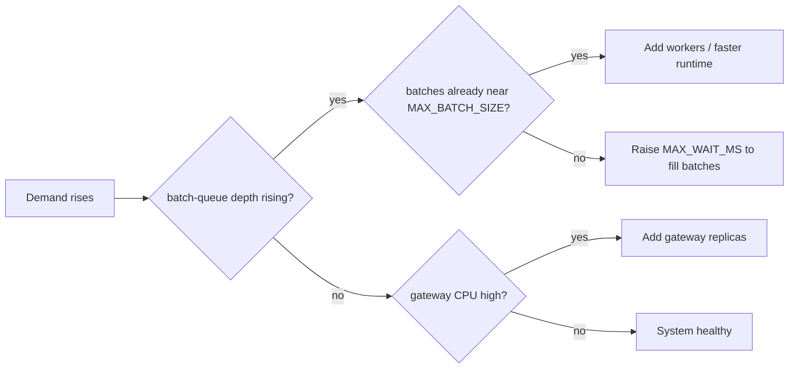

# Scaling Strategy

> Rule of thumb: **scale the tier that is the bottleneck, and measure the
> bottleneck by the queue depth *between* tiers.**

## 1. The three independent tiers

| Tier | What it costs | Scale signal | Knob |
|---|---|---|---|
| **Gateway** | CPU (JSON/multipart parsing, TLS, validation) | gateway CPU / inbound RPS | replicas (HPA on CPU) |
| **Scheduler** | tiny (in-memory batching) | request-stream depth growing | replicas (consumer group) |
| **Worker** | GPU/CPU compute (the forward pass) | batch-queue depth growing, GPU util | replicas (HPA on queue depth) |

Because they're separate processes joined only by Redis, you can scale any one
without touching the others — the whole point of the architecture.

## 2. Reading the queue depths

```
pip_platform_request_stream_depth   # gateway → scheduler backlog
pip_platform_batch_queue_depth      # scheduler → worker backlog
pip_platform_inflight_batches       # batches currently being computed
```

Diagnosis table:

| Symptom | Meaning | Action |
|---|---|---|
| request-stream depth rising, batch-queue ~0 | scheduler can't drain ingest | add scheduler replicas (rare; it's cheap) |
| batch-queue depth rising | workers can't keep up | **add workers** / bigger batch / faster runtime |
| both ~0 but gateway CPU high & latency up | the *front* is the wall | add gateway replicas |
| both ~0, GPU util ~100%, latency acceptable | healthy and saturated | you're at the efficient frontier |
| batch sizes small under load | batching not engaging | raise `MAX_WAIT_MS` or check traffic shape |

## 3. Why workers autoscale on queue depth, not CPU

A GPU worker can be at 100% GPU utilization while its **CPU** sits at 20%. A CPU
HPA would never scale it. The honest saturation signal for the worker tier is the
**batch-queue depth per worker** (or GPU utilization via DCGM). The
[worker HPA](../deploy/k8s/40-inference-worker.yaml) uses an external metric
(`pip_platform_batch_queue_depth`) surfaced by KEDA's Redis scaler or
prometheus-adapter.

## 4. The batching trade, restated as a scaling lever

Dynamic batching is *vertical* scaling of a single worker: it raises the
throughput of one accelerator by amortizing per-call overhead. Adding workers is
*horizontal* scaling. You almost always want both — first make each worker
efficient with batching (`MAX_BATCH_SIZE`), then add workers when one saturated,
well-batched worker still can't meet demand.



## 5. Capacity math (back of envelope)

Let `T_batch(N)` be the forward-pass time for batch size `N`. A single worker's
max throughput is `N / T_batch(N)`. With the simulated economics
`T_batch(N) = base + per_item·N`, throughput rises with `N` until `per_item·N`
dominates `base` — the point of diminishing returns that sets a sensible
`MAX_BATCH_SIZE`. Required workers ≈ `target_RPS / (MAX_BATCH_SIZE / T_batch(MAX))`.

Run [`benchmarks/concurrency_comparison.py`](../benchmarks/concurrency_comparison.py)
to measure `T_batch` for your hardware and plug in real numbers.

## 6. Statelessness & failure domains

- Gateway/scheduler hold no durable state → any replica handles any request;
  losing one drops only its in-flight requests (clients retry).
- Workers hold model state but no request state → a dead worker's in-flight
  batches are recovered by the janitor (at-least-once). See the
  [crash-recovery sequence](ARCHITECTURE.md#53-worker-crash-recovery).
- Redis is the single point of coordination → in production run it HA (Sentinel/
  Cluster or managed) and split ingest onto Kafka for higher fan-in.
